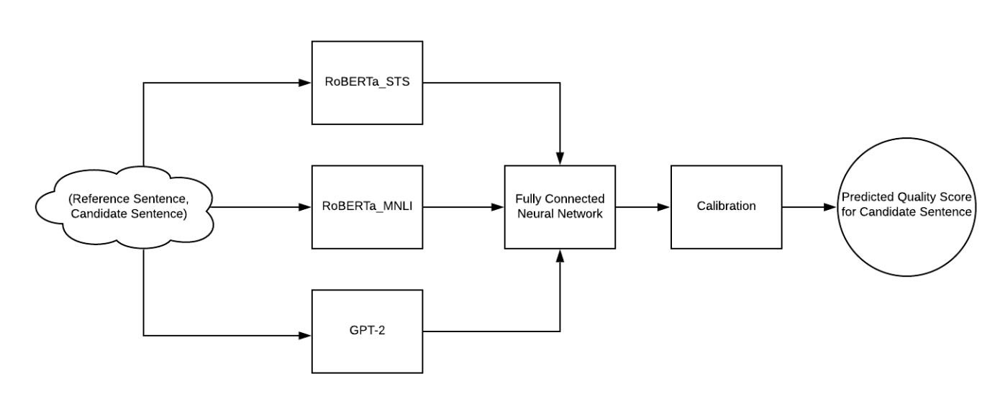
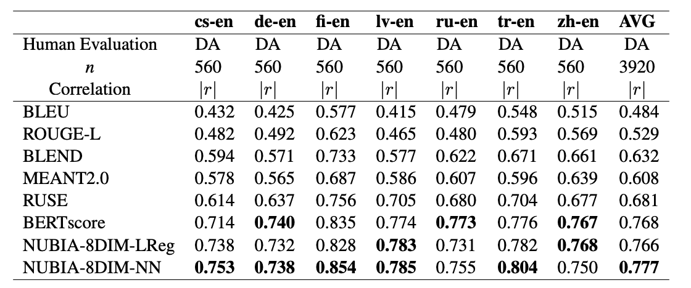
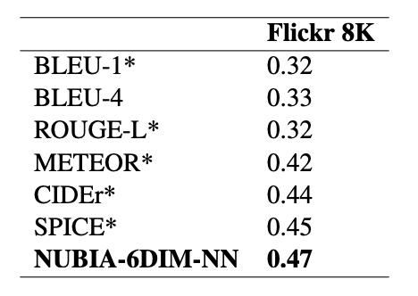
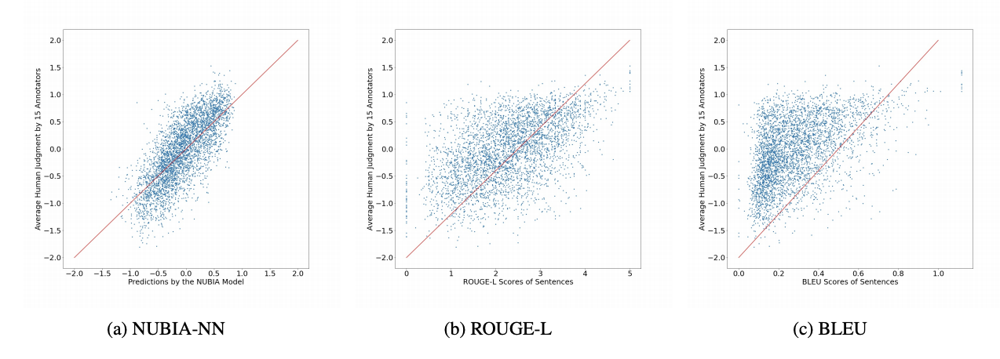

# Home

## What is NUBIA? 


NUBIA is a SoTA evaluation metric for text generation. It stands for NeUral Based Interchangeability Assessor. In addition to returning an interchangeability score, NUBIA also returns scores for semantic relation, contradiction, irrelevancy, logical agreement, and grammaticality. 

### [View Paper](https://arxiv.org/abs/2004.14667) | [Repo](https://github.com/wl-research/nubia) | [Notebook](https://colab.research.google.com/drive/1_K8pOB8fRRnkBPwlcmvUNHgCr4ur8rFg) | [Nubia Backstory](https://wl-research.github.io/blog/2020/04/29/introducing-nubia.html) | [FAQ](https://github.com/wl-research/nubia/blob/master/FAQ.md)


## How does it work? 



Nubia is composed of three modules. The first is neural feature extraction. The three main neural features that power the metric are semantic similarity, logical inference, and sentence legibility. These are extracted by exposing layers from powerful (pretrained) language models: RoBERTa STS for semantic similarity, RoBERTa MNLI for logical inference, and GPT-2 for sentence legibility. 

The second module is the aggregator. This module is trained to approximate a function mapping input neural features to a quality score that reflects how interchangeable the sentences are. The objective is to come as close as possible to human evaluation. 

The final module is calibration. This is necessary because the aggregator is not bound between 0 and 1, nor does a regressed score comparing a reference sentence with itself always ouput 1. So to calibrate, the output is normalized against the score of the reference sentence compared with itself, and bound between 0 and 1. 


## How does it perform? 

We have been able to achieve SoTA performance in assessing the quality of machine translation and image captioning. Results below are the Absolute Pearson correlations with segment-level human judgments on WMT17 to-English translations.



Results below are the Kendall’s Tau correlations with human judgment on the Flickr 8K dataset. 



Nubia is especially powerful against BLEU and ROUGE. The following are the score and label graphs of Nubia, ROUGE-L and BLEU for the entire WMT-2017 segment level set.




## Can you show me an example? 

The following two sentences mean the same thing: 

`s1, s2 = "He agreed to a proposal of mine.","He gave his agreement to my proposal."`

but the BLEU, ROUGE and BERTScore are low (0.43, 0.28, 0.63) whereas the Nubia score is 0.95

```
Rouge_1 is: 0.4285714235714286
Rouge_2 is: 0.0
BlEU is: 0.2802636449867835
BERTScore is: (0.5967282652854919, 0.6308560967445374, 0.6143679618835449)

Nubia Score: 0.9504227034094436

Semantic relation: 4.672990322113037/5.0
Percent chance of contradiction: 0.26220036670565605%
Percent chance of irrelevancy or new information: 0.5306123290210962%
Percent chance of logical agreement: 99.20719265937805%
```

Another example shows how the metrics can keep up despite differences in sentence structure: 


When `"Impossible!"` was changes to `"Totally feasible!"`, the contradiction score went from `0.073%` to `99.5%`, even though the `s1` is structured very differently. 

For more examples, check out the [repo](https://github.com/wl-research/nubia) and [colab notebook](https://colab.research.google.com/drive/1_K8pOB8fRRnkBPwlcmvUNHgCr4ur8rFg). To better understand the methodology and motivation check out the [paper](https://arxiv.org/abs/2004.14667) and [Nubia's backstory](https://wl-research.github.io/blog/2020/04/29/introducing-nubia.html). 

