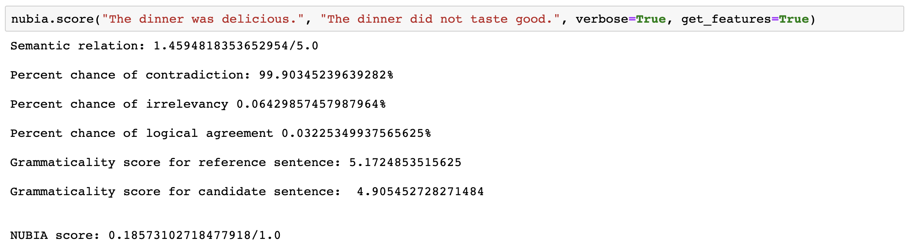

# Home

## What is NUBIA? 

NUBIA is a SoTA text similarity metric. It stands for NeUral Based Interchangeability Assessor. In addition to returning an interchangeability score, NUBIA also returns scores for semantic relation, contradiction, irrelevancy, logical agreement, and grammaticality. 

Check out our [paper](https://arxiv.org/abs/2004.14667), [repo](https://github.com/wl-research/nubia) and latest blog post: [Introducing NUBIA](https://wl-research.github.io/blog/2020/04/29/introducing-nubia.html).

